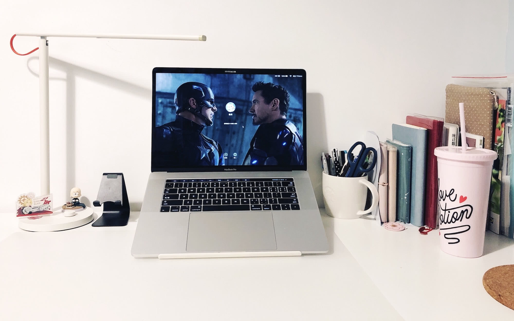

在 2019 年的 Q1 结束后，我的博客才终于步上正轨，花了两天时间魔改主题搬运几篇文章，终于能见人了……

`这是一篇小小的 Q1 总结`

<!--more-->

这个季度除了工作没有什么大项目以外，还是做了不少零碎的事的。

# 💻

建 portfolio 网页和 blog 算是重头戏吧，毕竟是代码小白，一点点摸索着调，也是花了不少时间。不过 portfolio 还没啥内容，不能溜出来——写总结拖延症犯，开放的总结还需要考虑到保密问题，即使当年写过 n 多零碎的文档可以参考也依旧令人头秃……相比之下，调网站样式简直像摸鱼一样愉快 _(:з」∠) _

# 📖

今年也终于开始用 hobonichi 的手帐本了——每个手帐 er 都躲不开的宿命。一日一页的结果就是我终于厌倦了拼贴……老老实实写字，对纸胶带和贴纸都没有爱了，根本没时间搞哇……这俩月已经开始了「工作日开天窗，周末疯狂补」的循环……

明年……应该会放弃一日一页了……

# ⛰

季度出行份额已完成 ✔️

三对朋友带着各自的狗子在郊区的山里小聚了一下，不用早起、吃着烧烤、玩着谋杀之谜的周末还是挺有意思的。

今年春天没出去看花花，应该还来得及吧~

---

