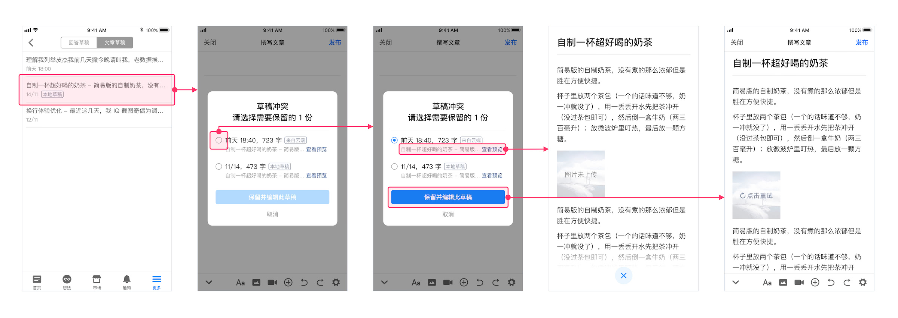

前段时间，我们在知乎的移动端富文本编辑器中，增加了这个辅助小功能，在弱网环境下自动保存本地草稿，从而减少网络不稳定带来的草稿内容丢失的情况。

<!--more-->

## 背景

草稿内容丢失的问题，因为难以复现所以无法准确定位原因，一旦发生就极其影响用户体验。我们一直在和技术团队一起思考解决方案。在修复真正的 bug 之前，我们也需要一些弥补手段减少这种情况的出现频率。

我们的草稿箱是自动保存机制，没有手动保存的按钮，用户在编辑内容的过程中，程序会以一定的规则自动将更改保存至服务器，这就意味着网络环境不稳定会导致部分编辑的内容无法正常保存，这也是导致草稿丢失的原因之一。

针对这种情况，我们决定增加一个「弱网下将草稿保存在本地」的功能。因为浏览器缓存太不稳定，所以这个功能只做到 app 中。

浏览器也是一个很重要的创作场景，我们针对电脑端操作的特性做了 `历史版本` 的功能，就不在本文赘述了。

## 产品思路

我在项目中主要的工作是交互和 UI 的设计，这个项目涉及到的页面很少，所以设计上的工作并不多，但是因为编辑器和草稿箱本身的复杂性，产品逻辑和技术实现方式，都需要和工程师沟通再细致敲定。

最终我们确定的方案细节就不说了，大体上的逻辑如下：

1. 用户在编辑内容的过程中，自动保存至云端如果失败了，客户端就立即保存一个本地草稿
2. 编辑的过程中网络恢复，则直接上传草稿至云端，并清除本地草稿
3. 如果在网络恢复前，用户离开了编辑器，则在其下次于同一设备上进入编辑器时，提醒草稿冲突，由其自行选择需要恢复的草稿（云端草稿和本地草稿）

## 最终设计

自动保存的过程不涉及到交互（只需要一个弱弱的「本地草稿保存中」的提示即可），主要的交互场景在后续的编辑过程中。

针对这个流程，我尝试了几种交互方案，有些因为技术成本的原因放弃了，最终我们选择了一个权衡方案，如下图：

## 后记

这不是一个需要看数据指标的项目。在我看来这个「小项目」其实做得不够完善，前期拿到需求时有些先入为主的概念，方案还有很多优化的空间。

实际上，弹窗并不是我们的首选方案，因为它会中断用户的正常操作。真实的使用场景中，大家面对这种弹窗时的耐心值总是极低的，可能连标题都没法认真看完。因此也可以有别的方案，比如说——

用户再次进入编辑器时，默认加载云端草稿，用一个小入口承载离线草稿，用户可以选择性地预览并替换当前草稿。

这个事情的逻辑就从「我必须立刻做出二选一的决定才能继续操作」变成了「你已经帮我做了选择，但我可以随时改变」，后者的心理压力要小很多，操作成本也更可控。将选择后置也会有个小问题，当默认加载的这份草稿与用户的预期有较大出入时，用户容易产生慌乱感——和被弹窗打断的负面感觉相比，哪个更强烈，还真不好说……

--------

Cover photo by [Florian Klauer](https://unsplash.com/@florianklauer?utm_source=unsplash&utm_medium=referral&utm_content=creditCopyText) on [Unsplash](https://unsplash.com/?utm_source=unsplash&utm_medium=referral&utm_content=creditCopyText)