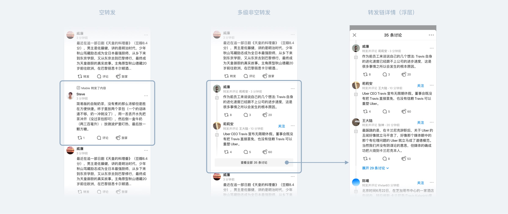
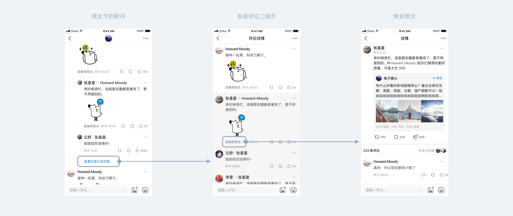

我到知乎参与的第一个项目就是「想法」，当时有较长的一段时间都在做转发及评论的改版，我参与了新版转评功能的方案制定，并完成了交互及 UI 的设计工作。

<!--more-->

## 为什么要改版

改版前，想法的转发效果有点像 Twitter（展示逻辑不一样，只是形式相似），将转发分为「空转发」和「包含文字的转发」，两种操作会产生不一样的内容样式。产品设计的初衷是将「空转发」定义为「对原文的扩散与分发」，认为「包含文字的转发」则是和原文同等重要的创作。

这样的设计，好处是每一级转发创作的内容都得到了充分的尊重，读者也可以与其中任意一级的作者互动。同时，也存在着一些问题：

1. 转发链较长的时候，前面的内容会被收起来，无法得到曝光，同时读者不了解前因后果也会造成一些理解上的困难
2. 阅读转发内容时的视觉动线是从下至上的，链条结构太长，追溯的成本就会很高
3. 转发一旦输入内容，形式就与原创想法基本相同，会提高用户的心理门槛
4. 空转内容无法被互动，一定程度上会打击用户转发的积极性

因此我们决定对原转发功能进行一次较大的改版。

## 我们的目标是……

（没……没有蛀牙？）

- 提升转发内容的阅读效率，使用户一眼就能识别转发内容
- 降低转发的创作心理门槛，别让产品形态阻碍用户使用功能（让大家想扩散内容或参与讨论的时候，能没有心理压力地进行转发）
- 让空转的内容也能得到互动

看上去似乎照着微博抄一遍就都解决了……这种嵌套式的转发结构确实符合我们的想象，但实际上情况要更麻烦一些，想法和微博有很多不一样的地方，我们也有一些独特的需求：

- 一条微博 140 字（虽然后来原创微博放宽了限制，但转发内容一直都是 140），而一条想法的上限是 2000 字……虽然基本上没有人会写那么长的内容，但产品方案上需要允许容纳比微博长很多很多的转发链条
- 用户在转发的时候输入内容，大部分情况下，参与互动的动机并不比发评论要弱，因此我们希望这些内容也能在评论区落地，获得更多曝光和被回复的机会
- 使用嵌套式的结构，无疑会牺牲中间层的互动按钮，但我们希望链条中的每一个有价值的讨论，都能够被读者触及

还有一个小问题，微博的转发格式（//@XXXX）是可以被「伪造」的，虽然以当时想法的量级来说，这个风险不大，但我们也需要有独特的转发样式，将这种风险扼杀在摇篮里……

## 最终设计

我们最终选择的就是嵌套式的结构——与需求匹配、用户无额外的学习成本。这种结构下，单条转发的想法，主要包含几个内容模块：转发的作者；转发链的内容；原文作者及内容；互动按钮。想法是通过关注关系流通的，被关注者的信息一定是用户关心的，也是他们想要互动的对象，因此如果卡片中只能保留一份互动按钮，那得是针对最外层的这条想法。

带内容的转发会在**上一级**想法下生成一条评论，这条评论带有转发原文的入口，用户可以在上一级的评论区与其互动，也可以「一键直达」这条想法。

## 后记

新版转评功能分了几期上线，数据表现和反馈情况都还是不错的，转发内容的量有了显著增长，涉及业务保密性，就不多说了。后来想法又陆续增加了转评带图和带表情的功能，更加完善了，用户在短内容社交中的需求基本都能得到满足。

