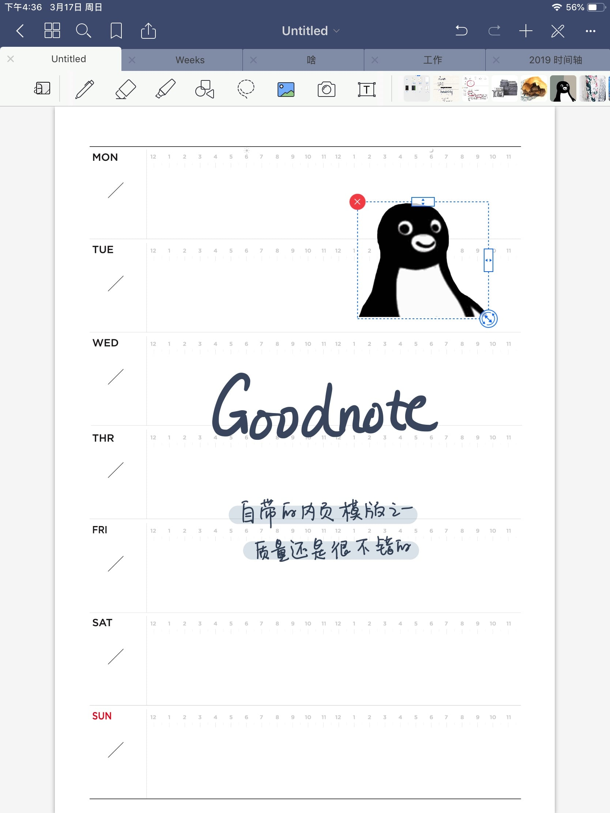

我是一个文具爱好者，各种大大小小的本子用过不少了，看到有人做电子手帐，刚好又有 iPad，于是忍不住也想尝试一下。

<!-- more -->

## App

不得不说手写笔记类的 app 的 UI 真的都挺一言难尽的……要不然极其简单甚至简陋，要不然就是分辨率不够的拟物风……

最开始我买了一个 Notability，忽略颜值吧，这可能是最适合用来做笔记的 app —— Drag and Drop 的兼容性做得好，pdf 之类的文档拖进来就能完成导入；可以纵向滑动页面，支持跨页书写，等于可以「无限」向下延伸的纸；还支持录音。

不过如果想做带点排版的手帐，这个就不适合了，连图片旋转的功能都没有，怎么塞可爱的小素材呢……

Goodnote 5 上线的时候我立刻就买了一个 4 和 5 的组合包——颜值是第一生产力。之前看过一些测评，说 Notability 的笔刷比 Goodnote 4 好，但是我实际（非重度）使用下来，感觉差异不大。

Goodnote 还是挺适合用来写「花里胡哨」的电子手帐的，对于 pdf 模板的支持呀、图片裁剪呀之类的功能都很友好。不过 Goodnote 5 整体的性能优化做得一般，文件过大会闪退，笔刷和橡皮也会有间歇性失效的 bug……

总之就是「都不完美」。不过鉴于我已经没有「做笔记」的需求了，最终还是 Goodnote 用得多一些。

## 模板

我对于模板的主要需求就是高效的格式。我不太愿意把它做成「很多张纸摞在一起」的效果，除非像 Paper 一样有与之匹配的拟物化交互，否则就感觉有点多此一举……当然这是个人喜好问题。

种草了手帐本，可以先弄个类似配置的模板试试电子手帐，避免买回来才发现不适合自己——比如说我就很难坚持写时间轴，试了两周就拔草国誉了……

Goodnote 5 自带的内页，很多都很好用，网上有很多博主也会分享内页模板，自己做的话，只需要导出成 pdf 放进去就可以用了。另外分享一个小技巧：可以在 Goodnote 里把图片插入到第一页前面，它就会变成封面，尺寸和内页不一样也没关系。

## 素材

这方面可以不用有太大心理负担，只要不外传不商用（写手帐毕竟是很私人的事），可以说你就拥有了一片素材的海洋……相比较真实的胶带和贴纸，缺少了一点动手的乐趣。

## 总结

如果你碰巧已经有 iPad 和 Apple pencil 了，那么电子手帐可以尝试一下。但我个人感觉这个和真实的手帐是完全不一样的体验，它唯一的优势可能就是省钱了——毕竟一个 app 五六十，然而入了手帐坑，谁能控制得住自己不买本子、书衣、胶带、贴纸、钢笔、彩墨、水彩、印章……呢？