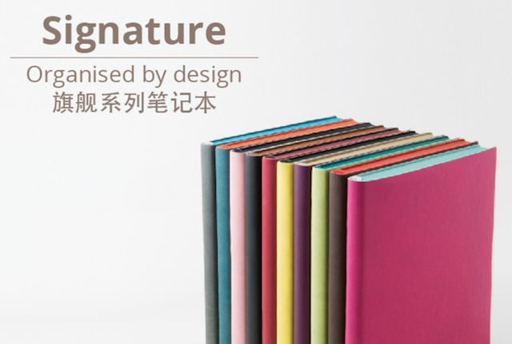

去年的文章了，搬运一下……

回想了下用过的一些手帐本，简单记录一下自己的使用体验。

虽然说，好像没有一本能恰如其分地匹配上我的需求（大概是不够贵……emmm……）但毕竟「百元以内」嘛，能满足一部分就可以了，还要什么自行车。

<!--more-->

## Midori - MD Notebook

圈内口碑非常好的一款手帐本，很均衡，在国外的手帐本里也算是比较便宜的选择。我买的 A5 方格本，淘宝价七八十吧。

这个本子拿到手会觉得很薄，一方面是因为用的轻量纸，应该不到 70 gsm，另一方面是因为也就 176 页，不算多的。需要用书衣，纸很光滑，有点透光。整个本子的设计非常简洁，日系性冷淡风无疑了。

优点：
① 纸的吸水性不强，所以不怎么透墨，完美 hold 住各种钢笔、荧光笔；水彩的话，简单的小画是没问题的，纸会微皱。
② 还是因为纸好，彩墨、水彩笔、荧光笔的色彩还原度高。最简单的检验方法，就是拿人手 n 支的 mildliner 划拉两下看看，我简直不敢信在某些纸上，这款笔的颜色居然能那么深那么土……很多能 hold 住大水枪的纸，一用 mildliner 就现原形，色彩还原度真是一件很微妙的事……
③ 格子线很浅，是很淡的蓝绿色，拼贴体验好。

缺点：
① 不适合中性笔书写，大概也是因为吸水性不强，中性笔写上去几百年都干不了啊，一蹭就花，而且写起来笔尖在上面直打滑，令人崩溃。
② 透光，正面写了啥背面都能看到，薄嘛，没办法。
③ 行间距，这个就见仁见智了。MD 方格本的行高是 5mm，写中文一行太小两行太大，有点尴尬，适合 m 尖以上的钢笔吧。其他大部分方格本行高都是 4mm，两行刚好。
④ 薄的纸就别指望能很好 hold 住印章了，月猫，卒

## KAZE 白夜

国内小团队做的巴川纸替芯，也是要用书衣的，纸比 hobonichi 还要薄。价格方面比 MD 略便宜一丢丢。

MD 有的特点它都有，纸超薄。类比到 MD 的几项说一下优缺点——

优点：
① 钢笔、荧光笔、简单的水彩，都可以的，不洇不渗。
② 色彩还原度完美，就是比 MD 还好一点的意思……
③ 方格本同样是浅浅的格子。

缺点：
① 中性笔再见，几千年都干不了了，不过写起来手感没有 MD 那么滑（它薄啊，它会发生形变呀）。
② 透光，非常透，正面写的东西背面看得一清二楚，基本就单面用吧……
③ 印章是什么？能给你透到第二张纸上去你敢信？

## Ameame 和时羽手帐

这俩放一起说，因为纸质和价格都差不太多，前者可能比后者要有名一点点。我买的都是 100 gsm A5 的替芯，一日一夜自填日期。Ameame 的设计要好看一点，格子颜色也略浅一点。

国内的小团队做的本子，每个批次可能都会调整用纸，所以现在你们买的话，纸质不一定和我用的一样（包括上面提到的 KAZE）。

优点：
① 纸厚，不管是写起来还是翻起来，都很有感觉（有人喜欢薄纸可以把这个当缺点……）
② 中性笔书写体验很好，水彩也不透，虽然纸会有一点皱，用针管笔写写画画会很放心，所以很适合要画点小配图的手帐，我现在基本就是拿来画画练手。
③ 印章基本上也没问题，毕竟厚。

缺点：
① 色彩还原度一般，也不能说差，但和上面两款本子比起来还是差了些。
② 品控很一般，有些钢笔会比较洇，f 尖不行，那效果反正我接受不了，不过因为品控不好，具体洇到什么程度也看脸。

## Daycraft 基本款横线本

香港的牌子，这个本子不需要用书衣，封皮软软的手感非常好！A5 的尺寸，淘宝现在的价格大概九十多。页数和 MD 一样，看上去更厚，因为纸厚一点。

优点：
① 中性笔之类的日常书写的笔，写起来手感完美。
② 色彩还原度虽然不算是特别好，但也还是不错的，比其他我用过的什么道林纸、书写纸要好很多。
③ 横线本行高 6mm！我的完美行高。划重点，国内大多数横线本都是 7mm 或者 8mm 的，如果用习惯了会觉得这个太小了。

缺点：
① 不太适合钢笔书写，我试过的有限几种里，ef 尖的还行，f 尖就有点洇了，只是比上面那款略好一点。
② 水彩也不太行，皱得比较厉害。
③ 线很深，内页非常商务了。

## 锦一

国产便宜又大碗的本子，我是抱着拿来画草图的心态买的，结果居然还不错欸。80 gsm 的纸也比想象中靠谱，纸质不算是特别优秀的，但七八十分还是妥的，不算出彩，也没啥毛病。快 300 页的本子才 30 块，你买不了吃亏买不了上当啊朋友。

外观和上面说的 Daycraft 有点像，包括封皮，手感差点，算是低配版吧。

水彩的效果我还没试，我有点困了，下面言简意赅……

优点：
① 钢笔、中性笔、针管笔、荧光笔、印章……基本都没问题，不洇不透不渗。
② 色彩还原度和 Daycraft 差不多，除去巴川纸和 MD，算是第三梯队吧。
③ 纸比较厚，该有的手感都有。

缺点：
① 味道是真的难闻，打开要吹几天风……我害怕我闻了要中毒……

---

最后小小补充俩踩坑的，虽然超过一百了——

**Moleskine**：关于纸质什么的，也不想多说了，其他人吐槽得够多了，如果你打定主意不写钢笔不画画，日常的书写还是不错的。用钢笔真的不行，非常不行。封皮好看是最大的亮点。

**Fulldesign**：一个小众韩国品牌，就是封面上的那本（没别的图，凑合一下），一日一页，如果不是因为是人肉背回来的我真不爱用，纸质不如 Moleskine 就算了，还不如路边十块钱仨的小破本，货比货得扔……