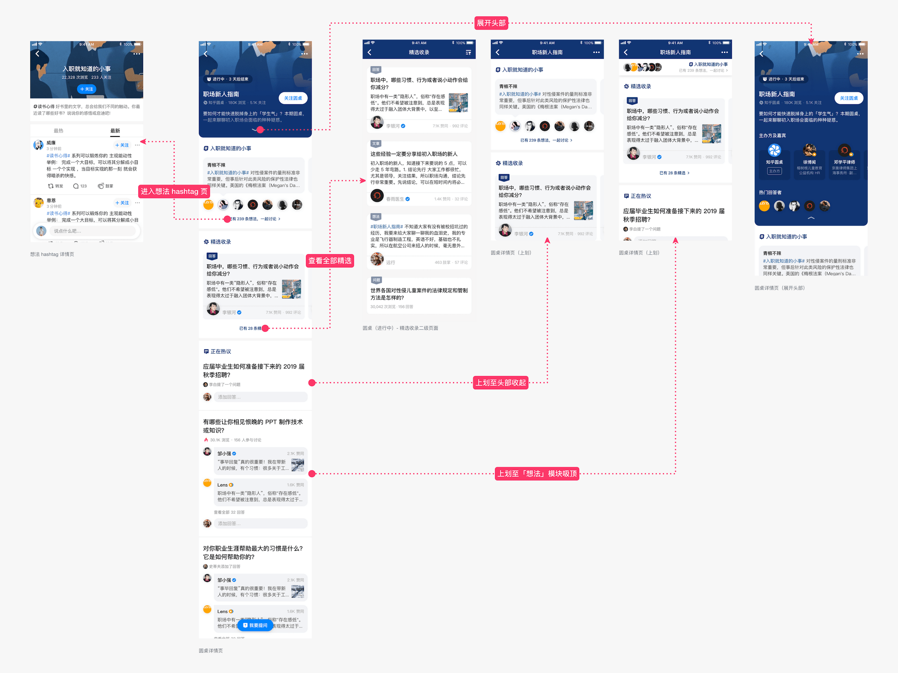
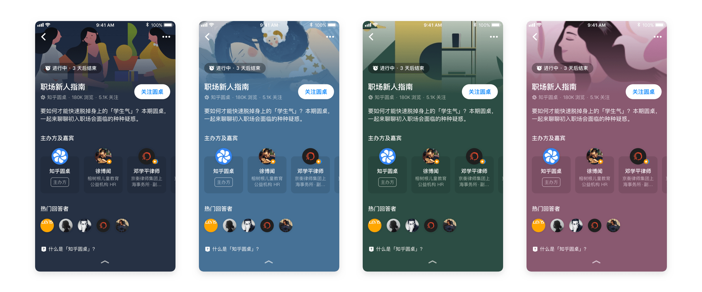
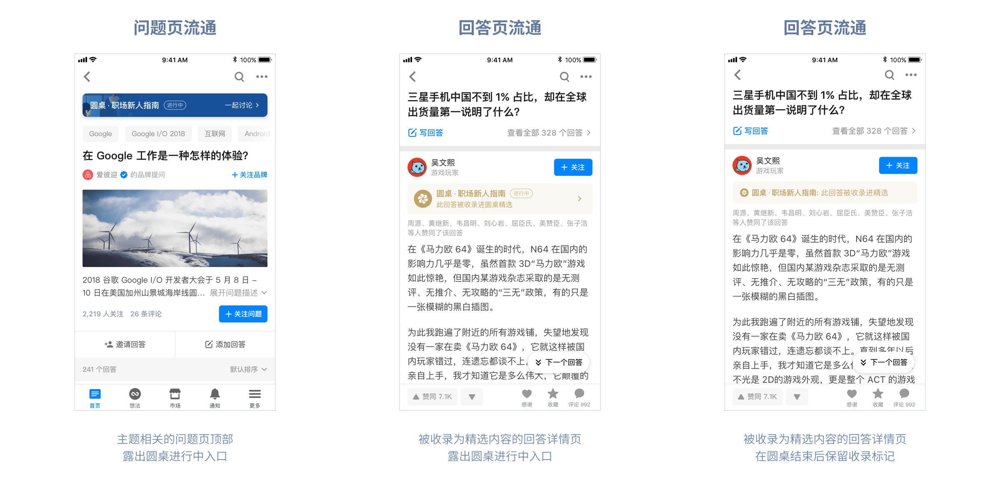

## 什么是「知乎圆桌」？

「知乎圆桌」是款非常具有「知乎特色」的讨论形式（可能很多用户并不太了解这到底是个什么产品……）它的独特之处在于——

- 在某一段时间内，引导全站用户集中讨论，具有时效性
- 讨论的主题往往针对某一细分领域，讨论内容偏向专业性
- 由站方运营人员发起，邀请相关领域的专业人士作为嘉宾，分享经验和见解，启发普通用户参与讨论

<!--more-->

## 背景

旧版的「圆桌」已经有相当一段时间没有更新了，还保留着早期知乎网站的设计风格。后续其他页面各种新功能上线后，没有被很好地照顾到的「圆桌」，流通上也有着比较大的问题。同时因其具有「时效性」，不是知乎重度用户可能都碰不上圆桌活跃的讨论期……

重启「圆桌」项目，就需要重新梳理需求，在保证核心概念不变的前提下，设计全新的「圆桌」产品。

我作为产品设计师参与了新版圆桌从产品逻辑到 UI 的完整设计过程。

## 目标分析

**一场「圆桌」的举办分为三个阶段**

- 预热期：站内宣传，为讨论的开展进行预热，此阶段的主要目标是 `引导关注圆桌`，次要目标是 `启发用户提问`
- 进行中：正式开展讨论的时间段，为期 1-2 周，主要目标是引导用户 `生产内容`、`参与互动`；同时消费型用户也能够方便地 `阅读优质内容`
- 结束后：不再引导讨论，用户来到该页面 `消费过往产生的优质内容` 即可

**需要解决的问题**

- 视觉设计方面：提升活动感，不能过于寡淡
- 内容方面：提供足够多可供消费的内容，同时使用户能方便地在当前页面进行创作
- 流通方面：提升内容自然流通的能力

## 思路及方案

**整体风格**

- 视觉上需要营造沉浸式讨论的氛围
- 突出活动感，降低用户参与的心理门槛

**内容类型 & 页面结构**

「圆桌」最主要承载的还是细分领域下的专业内容，因此产品的核心内容需要以问答为主，文章为辅。

另一方面，问答和文章的创作成本较高，绝大多数消费型用户难以参与其中，因此需要有一个心理门槛低的短内容载体，以供普通用户发表见解及互动。旧版圆桌使用的是评论，我们在做产品规划的时候，也曾考虑过使用聊天室的形式，但无论是评论还是聊天室，产生的内容都无法自然流通，具有一定的封闭性，因此我们最终选择将「想法」作为辅助互动的载体。

**方案尝试**

## 最终设计

### 头部配色示例

### 内容自然流通

## 后记

圆桌改版项目从启动到最终上线，历时近 2 个月左右的时间。虽然过程有点波折，但是结果令人欣慰，上线后数据表现非常好，关注和点击等指标都有好几倍的提升，用户在新版圆桌中产生的互动也显著高于旧版圆桌。（涉及业务保密性，具体数据无法透露）